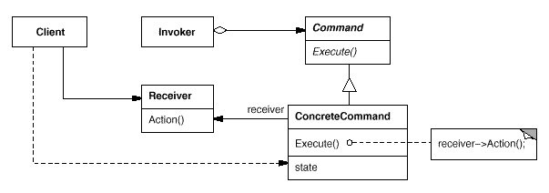

Command Pattern
-- 
Command 패턴은 실행될 기능이 다양하고, 변경이 필요할 경우 이벤트를 발생시키는 클래스에 대한 변경을 하지 않고
재사용하고자 할 때 유용하다. Command Pattern 역시 OCP 를 위배하지 않도록 설계하는 패턴이다. 


만약 불도 켜고, 볼륨도 올릴 수 있는 버튼을 만든다고 생각해보자.
```` java
public class Light {
    
    boolean isOn = false;
    
    public static Light createOffedLight() {
        return new Light();
    } 
    
    public void lightOn() {
        this.isOn = true;
    }
}

public class Volume {

    private int volume = 0;
    
    public static Volume createZeroVolume() {
        return new Volume();
    } 

    public void volumeUp() {
        this.volume += 1;
    }
}


class Button {
  
    private Light light; 
    private Volume volume;
    
    public Button(Light light, Volume volume) {
        this.light = light;
        this.volume = volume;
    }
    
    public void push(Command command) {
        if (command.equals(Command.lightPush) {
            light.lightOn();
        } else if (command.equals(Command.volumePush) {
            volume.volumeUp();
        }
    }
}
````

아마 확장에 대해 고려하지 않고 코드를 작성한다면 위와 같이 작성하게 될 것이다. 
위 코드에는 문제가 많다. 
- 만약 볼륨버튼을 누를시 볼륨을 줄어들게 하고싶다면?
- 만약 버튼이 할 수 있는 기능을 더 추가하고 싶다면?

우리는 Button 클래스의 push 메서드를 수정하고, Button 클래스의 필드에 또 다른 행위를 할 객체들을 연결시키게 될 것이다.
OCP 는 말할 것도 없고, 객체간의 결합도도 강해지게 된다. 

그래서 우리는 커맨드 패턴을 사용한다. 

```` java
public interface PushCommand {
    public void push();
}

public class LightPushCommand implements PushCommand {

    private Light light;

    public LightPushCommand(Light light) {
        this.light = light;
    }

    @Override
    public void push() {
        light.lightOn();
    }
}

public class VolumePushCommand implements PushCommand {

    private Volume volume;

    public VolumePushCommand(Volume volume) {
        this.volume = volume;
    }

    @Override
    public void push() {
        volume.volumeUp();
    }
}
````

위의 Command 인터페이스와 그 구현체들을 구현하고 Button 객체는 Command 인터페이스만 지니게 한다면

```` java
pubic class Button {

    private PushCommand pushCommand;

    public Button() {}

    public Button(PushCommand pushCommand) {
        this.pushCommand = pushCommand;
    }

    public void push() {
        pushCommand.push();
    }

    public void setPushCommand(PushCommand pushCommand) {
        this.pushCommand = pushCommand;
    }
}

// 버튼 사용
public class Client {
    public static void main(String[] args) {
        // This Button can Anything ! 
        Button anythingToDoButton = new Button();
        PushCommand pushCommandLight = new LightPushCommand(Light.createOffedLight());
        PushCommand pushCommandVolume = new VolumePushCommand(Volume.createZeroVolume());

        anythingToDoButton.setPushCommand(pushCommandLight);
        // Light On
        anythingToDoButton.push();

        anythingToDoButton.setPushCommand(pushCommandVolume);
        // Volume Up
        anythingToDoButton.push();
    }
}
````
각 객체들은 서로의 존재조차 모르게 훨씬 느슨하게 결합되며 기능이 변경되었을때, 해당하는 책임을 지닌 객체만 변경하고
기능이 확장될 때에는 해당하는 책임을 지닌 클래스를 추가만 하면 되는 구조가 되었다. 


**Command Pattern UML**  
;

