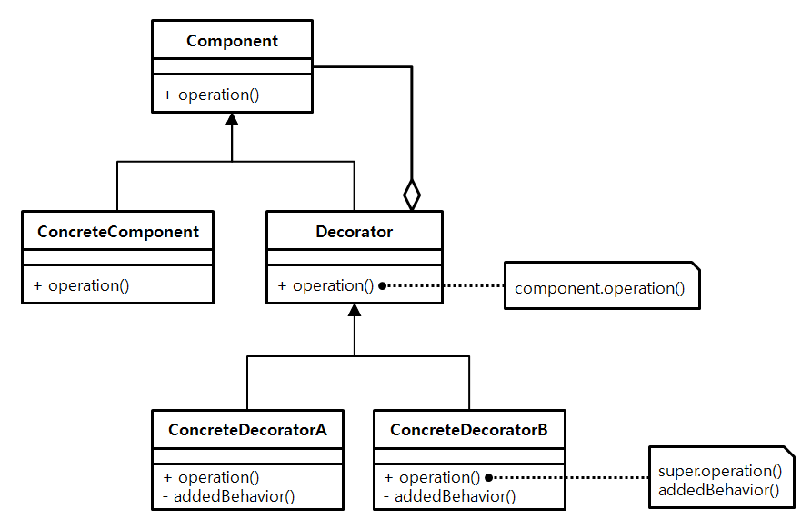

Decorator Pattern
--
Decorator Pattern 은 여러가지 기능을 조합하여 사용할때 유용하다.  
예를들어, 메시징을 하는 기능이 있는데 어떤 곳에서는 메일만 발송하고  
어떤 곳에서는 메일과 슬랙메시지를 또 다른 어떤 곳에서는 또 다른 조합을 발송한다고 생각해보자.

- 기능목록 
1. 메일발송
2. 슬랙메시지
3. 팀즈메시지
4. 잔디메시지 

- 조합의 가짓수  
위의 경우 4가지중 1개, 2개, 3개, 4개를 뽑는 순서가 있게 뽑는 경우의 수  
  총 64가지의 경우의 수가 나온다. 이런 경우 64개의 메서드 혹은 클래스를 생성할 수는 없지 않나!  
  
그래서 우리는 데코레이터 패턴을 사용한다.

**UML**  
  
  
데코레이터 패턴은 
1. 기능 수행의 역할을 하는 추상메서드 operation 을 지닌 추상 클래스 Component
2. component 를 확장하는 모든 조합중 기본이 되는 기능을 지닌 ConcreteComponent 클래스
3. 기타 조합하여 사용할 기능을 수행할 클래스들의 루트가 될 Component 타입 하나를 필드로 가지 추상 클래스 Decorator 
4. 마지막으로 Decorator 를 확장하는 자식 클래스들
  
로 이루어져 있다.
  
예제와 함께 살펴보자.

```java
public abstract class MessageService {
    public abstract void sendMessage();
}

public class BasicMessageService extends MessageService {
  @Override
  public void sendMessage() {
    System.out.println("기본 메시징 (메일을 보내~ ) 삐리링~");
  }
}
```
모든 메시지 기능을 수행하는 클래스들의 루트가 될 MessageService 와  
기본 기능 역할을 담당할 콘크리트 클래스 BasicMessageService 다.

```java
public abstract class MessageDecorator extends MessageService {

    private MessageService decoratedMessageService;

    public MessageDecorator(MessageService decoratedMessageService) {
        this.decoratedMessageService = decoratedMessageService;
    }

    @Override
    public void sendMessage() {
        decoratedMessageService.sendMessage();
    }
}
```
MessageService 를 상속한 추상 클래스 MessageDecorator 클래스다.   
필드로 MessageService 를 지니고, 해당 필드의 기본기능을 수행하는 것을 유심히보자.
  
```java
public abstract class MessageDecorator extends MessageService {

    private MessageService decoratedMessageService;

    public MessageDecorator(MessageService decoratedMessageService) {
        this.decoratedMessageService = decoratedMessageService;
    }

    @Override
    public void sendMessage() {
        decoratedMessageService.sendMessage();
    }
}

public class TeamsMessageDecorator extends MessageDecorator {

  public TeamsMessageDecorator(MessageService decoratedMessageService) {
    super(decoratedMessageService);
  }

  @Override
  public void sendMessage() {
    super.sendMessage();
    sendTeamsMessage();
  }

  private void sendTeamsMessage() {
    System.out.println("팀즈 메시지 전소오오오옹");
  }
}

public class JandiMessageDecorator extends MessageDecorator {

  public JandiMessageDecorator(MessageService decoratedMessageService) {
    super(decoratedMessageService);
  }

  @Override
  public void sendMessage() {
    super.sendMessage();
    sendJandiMessage();
  }

  private void sendJandiMessage() {
    System.out.println("잔디 메시지 전소옹");
  }
}
```
Decorator 클래스를 확장한 콘크리트 클래스들이다.  
모두 동일한 구조를 지니고, 각자의 기능을 지니고 Overide 메서드에서 부모의 기본 기능을 수행한 뒤 본연의 기능을 수행한다.  

MessageDecorator 의 기본 메서드의 기능을 기억하는 사람은 눈치챘을 것이다.  
기능 조합의 방법을 코드와 함께 살펴보자.

```java
public class Client {
    public static void main(String[] args) {
        MessageService mailMessaging = new BasicMessageService();
        mailMessaging.sendMessage(); // 메일 전송

        MessageService slackMessaging = new SlackMessageDecorator(new BasicMessageService());
        slackMessaging.sendMessage(); // 메일 전송, 슬랙 전송

        MessageService teamsMessaging = new TeamsMessageDecorator(new BasicMessageService());
        teamsMessaging.sendMessage(); // 메일전송, 팀즈 전송

        MessageService slackAndTeamsAndMailMessaging
                = new SlackMessageDecorator(new TeamsMessageDecorator(new BasicMessageService()));
        slackAndTeamsAndMailMessaging.sendMessage(); // 메일전송, 팀즈전송, 슬랙전송
    }
}
```
위와 같이 Decorator 패턴은   
1. 모든 기능의 조합을 Component 클래스의 선언으로 통일시킬수 있다.
2. 기능의 조합을 각 기능의 수만큼만 구현하면 모든 조합을 만들어낼 수 있다.
3. 조건문 등을 사용하여, 런타임에서 동적으로 조합을 만들어낼 수 있다.

라는 장점들이 있다. 


