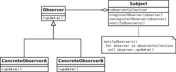

Observer Pattern
-- 
옵저버 패턴은 특정 클래스의 변경을 여러 클래스가 감지해야 하는 경우 유용하다.

역시 예제와 함께 살펴보자. 
Battery 가 변경될 때마다 알림을 보내는 시스템을 구현한다고 해보자.

```java
import observer.BatteryLevelDisplay;
import observer.LowBatteryWarning;

public class Battery {
    
    private int level = 100;
    private BatteryLevelDisplay batteryLevelDisplay;

    public void consume(int amount) {
        this.level -= amount;
        batteryLevelDisplay.display();
    }

    public int getLevel() {
        return level;
    }

    public static Battery newFullBattery() {
        return new Battery();
    }

    private Battery() {}
}

public class BatteryLevelDisPlay {
    
    private Battery battery;
    
    public void display() {
        System.out.println(battery.getLevel());
    }
    
    public BatteryLevelDisplay(Battery battery) {
        this.battery = battery;
    }
}
```

위와 같이 두 클래스는 상호 참조관계가 되어야하고, 내부의 구현 정보를 서로 알고 있어야한다.  
여기서 배터리가 일정 미만 떨어지면 알림을 주는 기능을 추가한다고 생각해보자.

```java
public class LowBatteryWarning {
    private final int ALERT_LEVEL = 10;
    private Battery battery;

    public void alert() {
        if (isBatteryReachedAlertLevel()) {
            System.out.println("Warning -- Low Battery!");
        }
    }

    private boolean isBatteryReachedAlertLevel() {
        return battery.getLevel() <= ALERT_LEVEL;
    }

    public LowBatteryWarning(Battery battery) {
        this.battery = battery;
    }
}

public class Battery {
    private int level = 100;
    private BatteryLevelDisplay batteryLevelDisplay;
    // 추가
    private LowBatteryWarning lowBatteryWarning;

    public void consume(int amount) {
        this.level -= amount;
        batteryLevelDisplay.display();
        // 추가
        lowBatteryWarning.alert();
    }
}
```
위와 같이 새로 추가된 클래스들와 Battery 클래스는 강한 연관 관계를 맺으며  
consume 메서드는 또 변경되게 된다. 

### UML  
;

Observer Pattern 은 상태 변경의 구독 대상이 될 슈퍼 클래스 Subject 와 그 실제로 사용되는 그 확장 클래스.   
그리고 상태 변경을 감지할 Observer 인터페이스와 그 구현체들로 이루어져있다. 

이제 Battery 객체에 Observer Pattern 을 적용하여 
위 예제의 객체간 강한 결합도를 끊어내보자.

```java
public interface Observer {
    void update();
}

public class BatteryLevelDisplay implements Observer {

    private Battery battery;

    @Override
    public void update() {
        display();
    }

    //... 위와 동일
}

public class LowBatteryWarning implements Observer {

    private Battery battery;
    private final int ALERT_LEVEL = 10;

    @Override
    public void update() {
        alert();
    }
    //... 위와 동일 
}

public abstract class Subject {
    // 상태 변경을 감지할 Observer 목록
    private List<Observer> observers = new ArrayList<>();
    
    public void attach(Observer observer) {
        observers.add(observer);
    };

    public void dettach(Observer observer) {
        observers.remove(observer);
    }
    // Observer 들에게 상태 변경을 알림
    public void notifyObservers() {
        for (Observer observer : observers) {
            observer.update();
        }
    }
}

public class Battery extends Subject {

    private int level = 100;

    public void consume(int amount) {
        this.level -= amount;
        notifyObservers();
    }
    // ... 위와 동일 
}
```

옵저버 패턴을 적용해보았다. Battery 클래스는 다른 클래스들과의 의존관계를 완전히 끊어내었고. 
기능을 확장하거나 축소할 때도 attach(), dettach() 메서드로 옵저버를 추가하거나 제거 주기만 하면된다.
