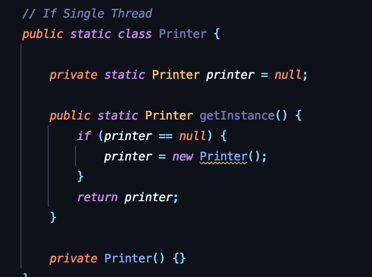
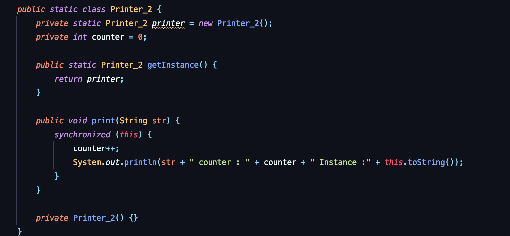
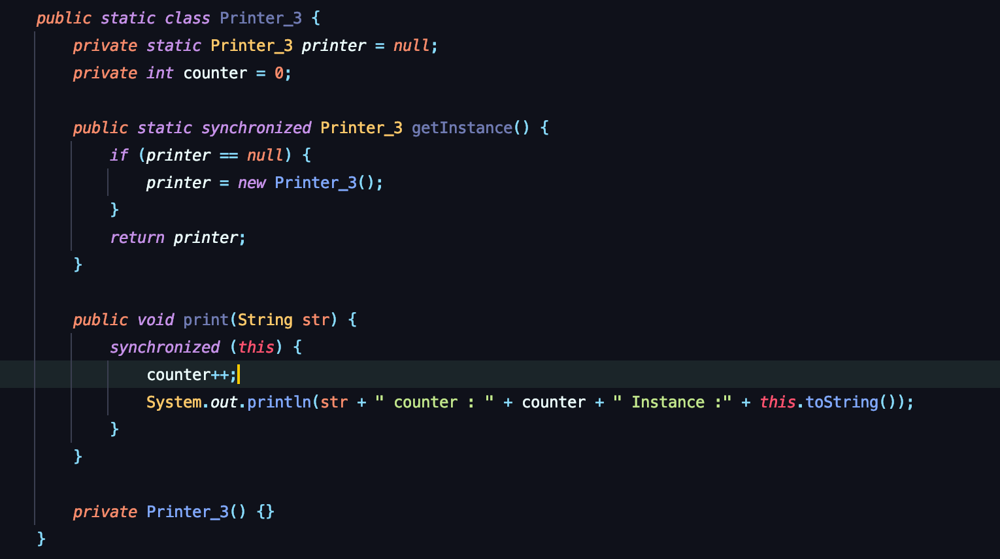

Singleton
--

*싱글톤 패턴이란, 프로그램 내에서 클래스의 인스턴스가 단 하나의 유일한 존재이도록 구현하는 패턴이다.*  
  
싱글톤의 구현은 기본적으로 다음과 같다.   

 - 외부에서 생성하지 못하도록 생성자의 접근제어자를 private 으로 변경한다.  
 - 자신의 타입을 가지는 정적 변수를 생성한다.
 - 생성한 변수가 null 일 경우 새로 생성하고 아닐 경우 해당 필드를 반환하는 public 정적 메서드를 생성한다.  

구현 코드는 아래와 같다.
> 참고 : 아래 모든 구현 코드는 한 클래스의 inner 클래스로 작성하여 static class 로 선언되어있지만, static class 일 필요는 없다.  

  

하지만 위 코드에는 치명적인 결함이 존재한다.
멀티 스레드 환경에서는 동일한 인스턴스를 반환하지 않는다는 것이다.
  
해결책으로는 2가지 방법이 존재한다.  
- 정적 변수에 인스턴스를 생성하여 초기화하는 방법
- 인스턴스 생성 메서드를 동기화하는 방법

*정적 변수에 인스턴스를 생성하여 초기화하는 방법*
  
*인스턴스 생성 메서드를 동기화하는 방법*
   

두 구현 코드에서 print() 메서드는 모두 동기화가 되어 있다.  
다중 스레드가 counter 필드에 접근하면 경합이 발생하여 의도하지 않은 결과가 나오기 때문.

> 단순히 print 기능만 사용하는 경우라면, 인스턴스 반환 메서드를 작성한 싱글톤 구현 없이 단순히 정적필드와 메서드만을 포함하는  
> 정적 클래스로 처리하는편이 단순하지만 Interface를 구현해야하는 경우 등 정적 클래스를 사용할 수 없는 경우가 존재한다.

