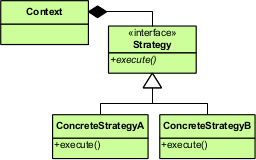

Strategy Pattern 
-- 

Startegy Pattern 은 객체의 행위 (전략) 을 기존 소스의 변경 없이 변경할 수 있도록 해주는 패턴이다.  
OCP(개방 폐쇄 원칙) 에 위배되지 않고 기능을 확장할 수 있다.  

  

- *Strategy* : 호출 부에서 동일한 방식으로 메시지를 보낼 전략을 명시한다.  
- *ConcreteStrategys* : 해당 전략을 수행할 방법들이며, 새로운 전략이 추가되면 콘크리트 클래스를 더 추가한다.  
- *Context* : Strategy 를 이용하는 역할, 필요에 따라 구현 전략을 교체할 수 있도록 setter 를 제공한다. 

